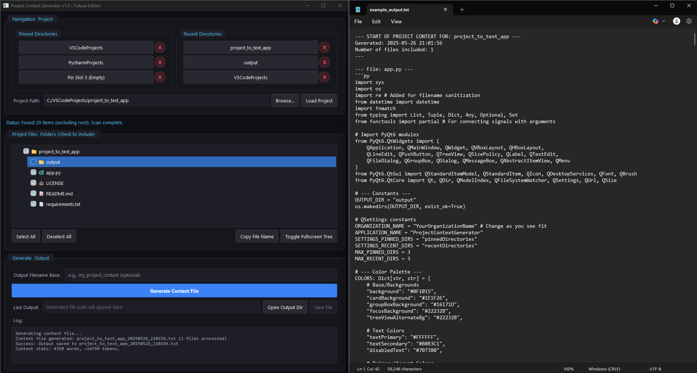

# Project Context Generator

This **PyQt6 desktop application** allows you to specify a local project directory, select files and folders, and generate a single text file containing their contents. This text file is formatted to be easily used as context for Large Language Models (LLMs) like Gemini, Claude, ChatGPT, etc.

## Features

- Browse a local project directory.
- Intuitive tree view for selecting/deselecting files and folders.
- Selection/deselection of a folder propagates to its children.
- Smart exclusion of common unnecessary files and directories (e.g., `.git`, `venv`, `node_modules`, binaries, logs).
- Customizable output filename.
- Generates a consolidated `.txt` file with a structured format.

- Output files are saved with timestamps to avoid overwriting.
- Pinned and Recent directories for quick access.
- Built-in file viewer for generated context and individual project files.
- Dark theme UI.

## Screenshots


*The main application window, displaying a project's file tree and options for selection.*

## Setup

1.  **Clone the repository:**
  ```bash
  git clone https://github.com/your-username/project-context-generator.git # Replace with your actual repo URL after creating it
  cd project-context-generator
  ```

2.  **Create a virtual environment (recommended):**
  ```bash
  python -m venv venv
  source venv/bin/activate  # On Windows: venv\Scripts\activate
  ```

3.  **Install dependencies:**
  ```bash
  pip install -r requirements.txt
  ```
  *(The `output` directory will be created automatically by the application if it doesn't exist.)*

## Usage

1.  **Run the application:**
  ```bash
  python app.py
  ```
2.  **Enter or Browse** for your project's root directory.
3.  Click "**Load Project**".
4.  The file tree will populate. **Check/uncheck** items to include/exclude them from the context.
  - Folders can be expanded/collapsed.
  - Selecting/deselecting a folder affects all its children.
5.  (Optional) Enter a **custom base name** for the output file (e.g., "my_api_features").
6.  Click "**Generate Context File**".
7.  The generated file will be saved in the `output` directory. The path will be displayed, and you can use the "View File" or "Open Output Dir" buttons.
8.  Copy the content from the generated `.txt` file and paste it into your LLM prompt.

## Configuration

- The application uses `QSettings` to store pinned and recent directories. If you wish to change the storage location key for these settings (e.g., for a fork), you might want to modify `ORGANIZATION_NAME` and `APPLICATION_NAME` constants at the top of `app.py`.

## Contributing

Contributions are welcome! If you have suggestions for improvements or bug fixes, please feel free to:
1. Fork the repository.
2. Create a new branch (`git checkout -b feature/your-feature-name`).
3. Make your changes.
4. Commit your changes (`git commit -m 'Add some feature'`).
5. Push to the branch (`git push origin feature/your-feature-name`).
6. Open a Pull Request.

## License

This project is licensed under the MIT License - see the [LICENSE](LICENSE) file for details.
